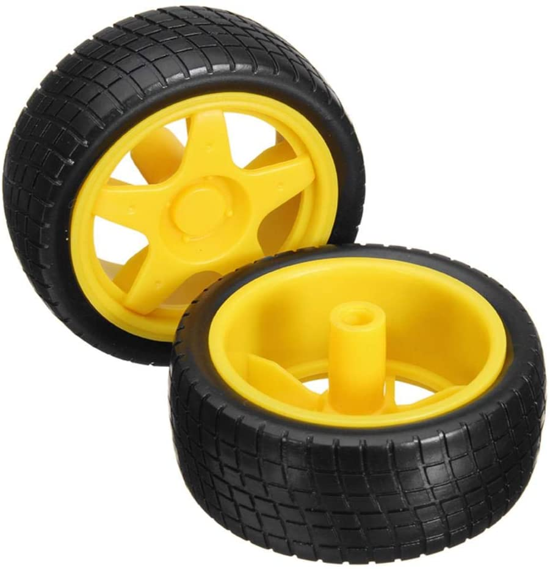
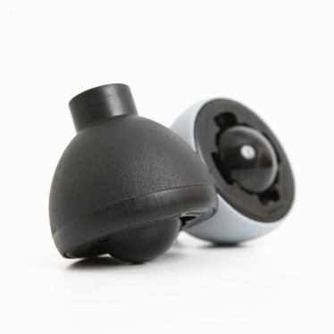
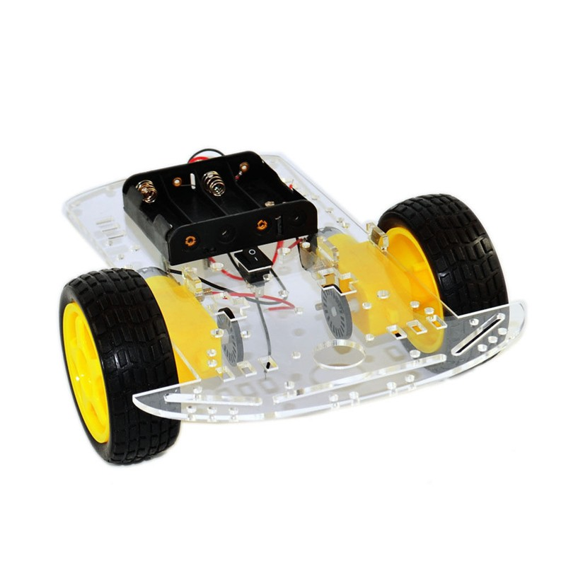
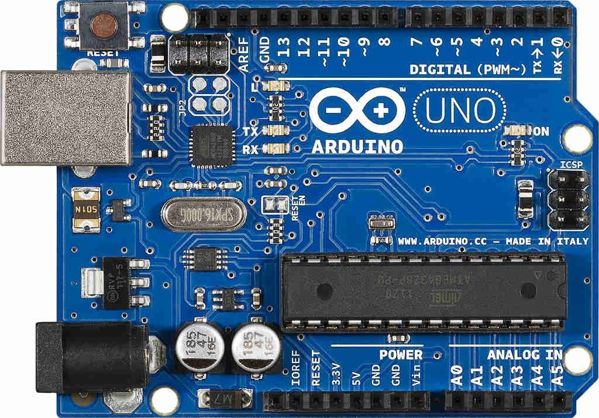
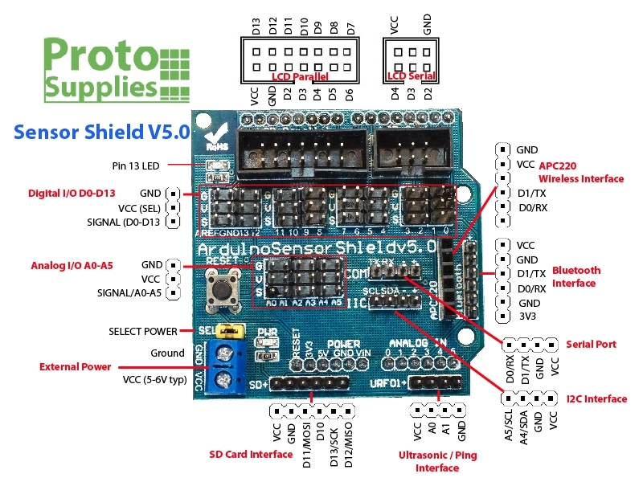
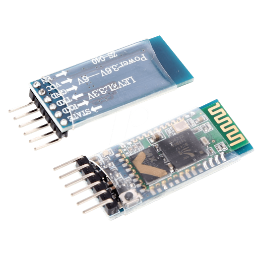
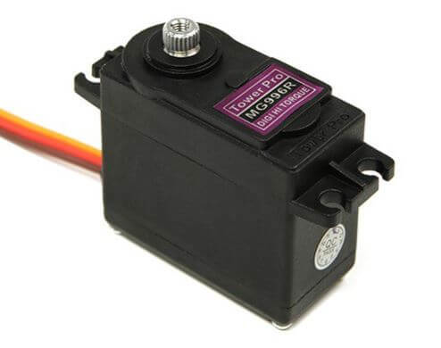
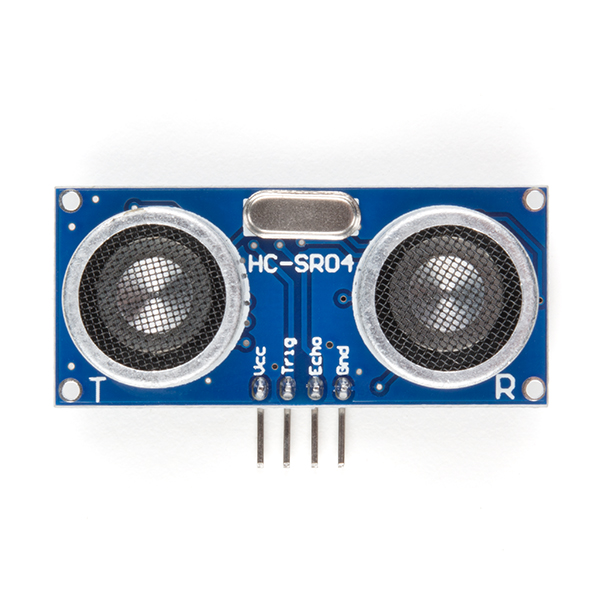

# Avoinding Obstacles using Arduino & Q learning
It's a robot car that learn to avoid obstacles from it's environement, we have used a Reinforcement Machine Learning algorithm called Q Learning. 

## Used hardware : 
| Hardware  | DC Motors |
| ------------- | ------------- |
| Utility  | Content Cell  |
| Image |   |

* ### 2 DC Motor

* ### L298N : driver of DC motors

* ### 2 Cerle Wheels and 1 Spherical Wheel 
 

* ### Chassis 

* ### Power supply

* ### Arduino Uno

* ### Sensor shield V5.0 : provides a convenient way to interface to Sensors

 
* ### Bluetooth module : Debuging code

## step 3 :
* ### Servo motor : turning the HC-SR04 Sensor

* ### HC-SR04 Ultrasonic Sensor : calculating distance

